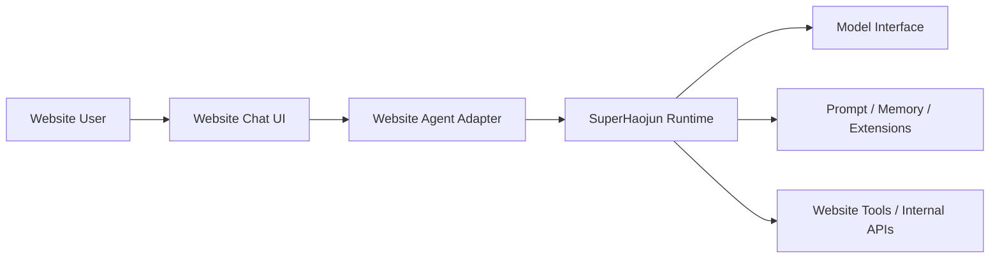

# Website Agent Handoff

## Purpose

This document is a fast handoff guide for integrating `SuperHaojun` into a personal website as the site's agent runtime.

It is not a full architecture reference. The reader is expected to read code. This document exists to answer three questions quickly:

1. What role should `SuperHaojun` play inside the website system?
2. Which parts should be reused as core runtime, and which parts should be adapted for the website?
3. In what order should someone read the code to become productive fast?

## Target Integration

The current intended product shape is:

- the website sends user requests into the harness through a model-facing agent interface
- the harness supports at least:
  - real-time question answering
  - website-internal operations exposed as tools or internal APIs
- the website should use `SuperHaojun` as the agent runtime core, not just as a prompt template or thin chat wrapper

## Architecture Snapshot



### Reading this diagram

- `Website Chat UI`
  Handles website-specific rendering, auth-aware UX, and product interaction.
- `Website Agent Adapter`
  The thin integration layer between website requests and the harness runtime.
- `SuperHaojun Runtime`
  Owns the agent loop, turn state, tool orchestration, command semantics, and explainability surfaces.
- `Model Interface`
  The actual LLM provider or provider adapter used by the website.
- `Prompt / Memory / Extensions`
  Project rules, persistent memory, and repo-local extension behavior that shape agent behavior.
- `Website Tools / Internal APIs`
  The website's own actionable capabilities, exposed to the runtime as tools instead of hidden special cases.

## Reuse vs Adapt

| Area | Recommendation | Why |
|---|---|---|
| Agent loop | Reuse | `SuperHaojun` already has a working, explainable runtime loop |
| Turn state and runtime visibility | Reuse | this is one of the strongest parts of the harness and should remain canonical |
| Tool orchestration | Reuse | website actions should plug into existing tool semantics |
| Prompt / memory / extensions | Reuse with site-specific additions | website behavior should be shaped through context and rules, not by forking the loop |
| WebUI frontend | Reference only | useful as a working example of streaming and visibility, but not necessarily the final website UI |
| Website request adapter | New | the website needs its own boundary for auth, request shaping, and response streaming |
| Website internal API bridge | New | site actions should be wrapped as tools or tool-like adapters |

## Core Design Decision

Treat the website integration as **an adapter around the harness**, not as a rewrite of the harness.

That means:

- keep `SuperHaojun` responsible for agent semantics
- keep the website responsible for product semantics
- connect them through a thin adapter and a set of website-specific tools

In practice, the website should avoid adding one-off branches like:

- "if this is a website request, skip normal tool flow"
- "if this is a UI action, bypass the runtime"
- "if this is a site API call, handle it outside the agent model"

The more website behavior goes through the existing runtime, the more consistent and explainable the system stays.

## Two Main Flows

### 1. Realtime Ask

This is the standard website chat path.

```text
User message
-> website request handler
-> website agent adapter
-> SuperHaojun agent loop
-> model streaming
-> tool calls if needed
-> streamed response back to website UI
```

What matters:

- the website should preserve streaming instead of waiting for a final full response
- the website should preserve runtime visibility where possible
- the website should not create a second private execution model that diverges from the harness

### 2. Website Internal Operation

This is the path for actions inside the site, such as querying private data or triggering an internal workflow.

```text
User request
-> model decides an action is needed
-> harness invokes a website tool
-> tool bridge calls website internal API / service
-> tool result returns to harness
-> harness continues response generation
```

What matters:

- internal operations should look like tools to the runtime
- permissions, traceability, and raw tool visibility should remain intact
- website adapters should stay thin and deterministic

## What To Preserve

These are the parts of `SuperHaojun` that are especially worth preserving during website integration:

### 1. Explainability First

The harness should remain understandable to operators and users.

Preserve:

- visible agent phase
- visible tool activity
- visible interruption and terminal states
- visible counters and turn state

Do not replace raw state with summary-only UI.

### 2. One Runtime, Multiple Surfaces

CLI, TUI, and WebUI were recently aligned around shared runtime assembly. The website should continue that pattern rather than invent a separate hidden runtime.

### 3. Tool-Centric Action Model

If the website wants the agent to do something actionable, prefer exposing it as a tool instead of hard-coding special logic in the adapter layer.

### 4. Context Shaping Over Loop Forking

If website behavior needs to change, first ask:

- should this be prompt context?
- should this be memory?
- should this be an extension?
- should this be a tool?

Only change core runtime behavior when the change is truly runtime-level.

## Recommended Integration Boundary

The website integration should probably have one explicit module that plays this role:

- accepts a website request
- resolves user/session/site context
- constructs the harness-facing request
- chooses or injects the active model interface
- streams events or final output back to the website layer

Conceptually, this module should be a **website agent adapter**, not a second agent framework.

Good responsibilities for this adapter:

- auth-aware user identity and session lookup
- request normalization
- site-specific context injection
- mapping website transport to harness transport
- output streaming back to the site

Bad responsibilities for this adapter:

- reimplementing tool orchestration
- reimplementing turn state
- secretly handling actions outside the runtime
- becoming the real home of business logic that should live in tools

## Reading Order

## 15-Minute Orientation

Read these first:

- `README.md`
- `specs/development-rules.md`
- `specs/features/runtime-assembly.md`
- `specs/features/tool-orchestration.md`
- `specs/features/turn-runtime.md`

This gives the reader:

- repo shape
- core runtime assembly
- how tools execute
- how visible turn state works

## 1-Hour Core Reading

Read these next:

- `src/superhaojun/runtime.py`
- `src/superhaojun/agent.py`
- `src/superhaojun/turn_runtime.py`
- `src/superhaojun/tool_orchestration.py`
- `src/superhaojun/prompt/builder.py`
- `src/superhaojun/extensions/runtime.py`
- `src/superhaojun/memory/store.py`

This is the minimum set for understanding:

- how the runtime is assembled
- how a turn runs
- how tools are scheduled
- how prompt shaping works
- how long-lived context is injected

## If You Need Streaming / Browser Behavior

Read these:

- `src/superhaojun/webui/server.py`
- `webui/src/hooks/useWebSocket.ts`
- `specs/features/webui-chat.md`

These are useful when the website team needs:

- streaming reference behavior
- interrupt behavior
- runtime snapshots for UI
- a proven example of frontend/backend event handling

## If You Need Site Actions

Read these:

- `src/superhaojun/tools/`
- `src/superhaojun/tools/base.py`
- `src/superhaojun/tools/registry.py`
- `specs/features/tool-system.md`
- `specs/features/tool-orchestration.md`

This is the right entry if the website wants:

- internal APIs
- CMS or content actions
- account-aware operations
- admin or workflow triggers

## If You Need Site-Level Rules or Persona

Read these:

- `specs/features/prompt-context.md`
- `specs/features/memory-entry.md`
- `specs/features/skills-plugin-runtime.md`
- `src/superhaojun/prompt/`
- `src/superhaojun/extensions/`

This is the right entry if the website wants:

- site persona
- editorial rules
- business/domain constraints
- reusable website-local behavior shaping

## Suggested Code Map

| File | Why it matters |
|---|---|
| `src/superhaojun/runtime.py` | shared runtime construction and dependency wiring |
| `src/superhaojun/agent.py` | top-level turn execution loop |
| `src/superhaojun/turn_runtime.py` | explicit per-turn state and explainability |
| `src/superhaojun/tool_orchestration.py` | tool batching, permissions, hooks, result handling |
| `src/superhaojun/prompt/builder.py` | prompt assembly entry point |
| `src/superhaojun/extensions/runtime.py` | repo-local behavior and instruction loading |
| `src/superhaojun/memory/store.py` | persistent memory and prompt-entry shaping |
| `src/superhaojun/webui/server.py` | reference adapter for browser streaming and runtime exposure |

## Integration Heuristics

### Strong defaults

- use the harness as the canonical runtime
- use website-specific tools for website actions
- keep the website adapter thin
- keep streaming end to end
- preserve raw runtime visibility

### Avoid by default

- hiding site actions outside the tool path
- introducing a second invisible state machine in the website layer
- flattening interruption and tool activity into opaque final text
- overfitting the core runtime to website-specific business rules

## Watchpoints

### Provider instability is not always a harness bug

The model layer can return transient provider errors. Treat provider failures separately from runtime design problems.

### Website tools need permission and safety semantics

Site-internal actions may be more sensitive than file tools. Decide early whether website tools need:

- allow/deny behavior
- user confirmation
- per-user authorization
- audit logging
- idempotency guarantees

### WebUI is a reference, not a mandate

The current WebUI is a good example of streaming and explainability, but the personal website does not need to reuse its exact UI structure.

### Keep website context additive

Website-specific identity, business state, and internal data should be injected into the runtime in a way that is inspectable and bounded, not hidden in unstructured side channels.

## First Practical Next Step

Before implementing the website integration, create one active spec for the adapter boundary, for example:

- `specs/features/website-agent-adapter.md`

That spec should define:

- how website requests enter the runtime
- where user/session/site context is injected
- how model selection is resolved
- how website-internal APIs are exposed as tools
- what streaming contract the website frontend receives

## Final Orientation

If the reader only remembers one thing, it should be this:

> `SuperHaojun` should remain the agent runtime core.  
> The website should wrap it, feed it context, and extend it through tools, not quietly replace its execution model.
